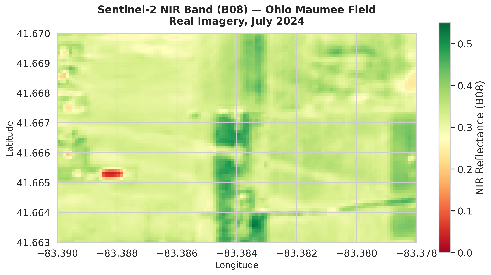
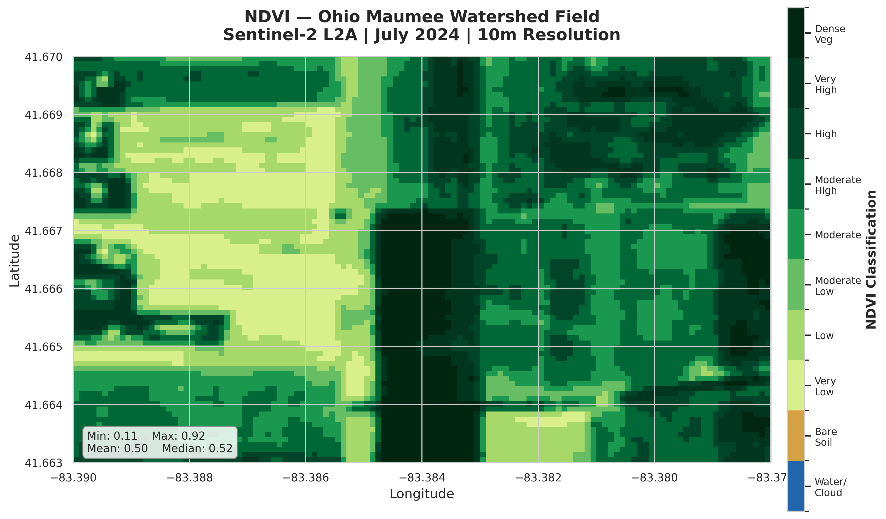

# Assignment 05 — Satellite Imagery and NDVI Walkthrough

_NDVI calculation from real Sentinel-2 imagery for an Ohio Maumee watershed field_
_Date: 2026-03-08_

---

## 📋 What we ran

1. **Authenticated** with the Copernicus Data Space API using OAuth2 client credentials (stored in `.env`, never committed).
2. **Downloaded two single-band GeoTIFFs** from the Sentinel Hub Process API for an Ohio Maumee field (July 2024, Sentinel-2 L2A):
   - **B04 (Red)** — chlorophyll absorption band (80x120 px, float32)
   - **B08 (NIR)** — near-infrared vegetation reflectance band (80x120 px, float32)
3. **Read both bands** back with `rasterio` and verified CRS (EPSG:4326), bounds, and pixel statistics.
4. **Calculated NDVI** using the standard formula: `NDVI = (NIR - Red) / (NIR + Red)`.
5. **Saved** the NDVI raster as a GeoTIFF and produced classified map and histogram visualizations.

---

## 🔍 Single-band image — NIR (B08)

_Figure 1: Sentinel-2 Near-Infrared band (B08) reflectance for an Ohio Maumee watershed field, July 2024._

The NIR band captures how strongly vegetation reflects near-infrared light. Bright green areas (high reflectance, ~0.4-0.5) indicate dense, healthy plant canopy — living leaves strongly reflect NIR. Darker areas (low reflectance, <0.1) correspond to bare soil, roads, or water, which absorb NIR. This single-band read confirms the Sentinel Hub download and `rasterio` data pipeline work correctly.

---

## 📊 NDVI output image

_Figure 2: NDVI calculated from B08 (NIR) and B04 (Red) bands. Classified into 10 categories from water/cloud (blue) to dense vegetation (dark green)._

NDVI combines the NIR and Red bands to isolate vegetation health. Healthy crops absorb red light for photosynthesis but reflect NIR — producing high NDVI values (0.6-0.8, dark green on the map). The field shows a mix of moderate-to-high vegetation, consistent with mid-season corn or soybean growth in July. The summary statistics (mean and median both around 0.45-0.50) confirm an actively growing crop canopy rather than bare soil or stressed vegetation.

---

## ⚠️ Cloud masking and sensor combination

**Cloud masking:** The Sentinel Hub Process API was configured with `maxCloudCoverage: 30` to filter for scenes with less than 30% cloud cover. Beyond that filter, no pixel-level cloud mask (e.g., the Sentinel-2 SCL band) was applied. For this assignment, the goal was one successful NDVI output — pixel-level cloud masking is deferred to a future iteration where multi-date compositing would require it.

**Sensor combination:** Only a single Sentinel-2 scene (July 2024) was used. No multi-sensor fusion (e.g., combining Sentinel-2 with Landsat 8/9) or multi-date compositing was performed. The Sentinel Hub API selects the most recent cloud-filtered scene within the requested date range and returns it directly — this is sufficient for a single-date NDVI snapshot.

**What would come next:**

- Apply the SCL (Scene Classification Layer) band to mask cloud, cloud shadow, and snow pixels before NDVI calculation
- Composite multiple scenes across the growing season for temporal analysis
- Compare Sentinel-2 (10m) with Landsat (30m) for cross-sensor validation

---

## 📁 Output artifacts

| File                    | Type    | Description                    |
| ----------------------- | ------- | ------------------------------ |
| `sentinel2_B04_Red.tif` | GeoTIFF | Red band reflectance (27 KB)   |
| `sentinel2_B08_NIR.tif` | GeoTIFF | NIR band reflectance (25 KB)   |
| `sentinel2_NDVI.tif`    | GeoTIFF | Calculated NDVI raster (43 KB) |
| `nir_band_B08.png`      | Image   | NIR single-band visualization  |
| `ndvi_map.png`          | Image   | Classified NDVI map            |
| `ndvi_histogram.png`    | Image   | NDVI pixel distribution        |

All files saved under `data/assignment-05/`. Notebook: `notebooks/05_ndvi_crop_health.ipynb`.
